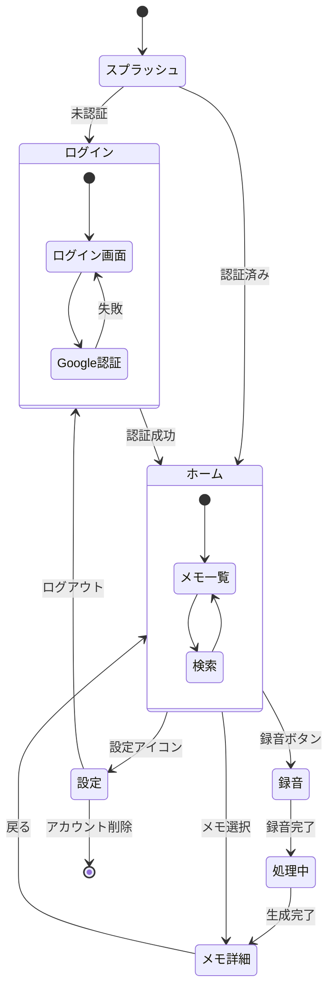

# 画面遷移図

## 概要

VoiceBookLM アプリの画面遷移フロー

## State Diagram

## 画面一覧

| 画面 | ルート | 説明 |
|------|--------|------|
| スプラッシュ | - | 認証状態チェック |
| ログイン | `/` | Google認証 |
| ホーム | `/home` | メモ一覧・フォルダ |
| 検索 | `/search` | メモ検索 |
| 録音 | `/record` | 音声録音 |
| 処理中 | `/processing` | AI処理中 |
| メモ詳細 | `/note/[id]` | メモ詳細表示 |
| 設定 | `/settings` | アカウント設定 |

## 遷移条件

### 認証フロー
- **未認証** → ログイン画面
- **認証済み** → ホーム画面
- **ログアウト** → ログイン画面
- **アカウント削除** → アプリ終了

### メイン操作
- **録音ボタン** → 録音画面
- **録音完了** → 処理中画面
- **生成完了** → メモ詳細画面
- **メモ選択** → メモ詳細画面
